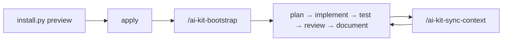

# AI-KIT

**Stop re-explaining your project to every new AI chat.**

AI-KIT drops a complete working environment for AI coding agents into your repository: project memory that survives every session, expert rules for **Go, PHP, Laravel, Filament 5, Moodle, and Python**, a **Kubernetes-ready** container standard, safety guardrails, **adaptive model routing**, and native configuration for **11 AI clients**. One installer, zero dependencies, nothing written until you approve the preview.

[Features](#features-at-a-glance) · [Quick start](#install) · [Stacks](#-built-for-your-stack) · [Presets](#presets) · [Update](#update-an-application-project)

## Features at a glance

| | Feature | What it does for you |
| --- | --- | --- |
| 🧠 | **Project memory** | Verified facts, module map, commands, and decisions that every new chat reads first |
| 🧩 | **Stack profiles** | Expert rules for Go, PHP, Laravel, Filament 5, Moodle, Python, frontend, and libraries, auto-detected per module |
| 🐳 | **Kubernetes-ready containers** | Every new Dockerfile and service ships with probes, graceful shutdown, non-root security, and manifests |
| 🧭 | **Adaptive model routing** | A 0-6 capability ladder that picks the right model role and reasoning effort for each task |
| 🤖 | **11 AI clients** | Codex, Claude Code, Cursor, Copilot, Gemini CLI, Windsurf, Cline, Roo, Aider, Kimi, Manus — with documentation evidence and lifecycle reporting |
| 🎯 | **Native client configuration** | Your real test commands run without prompts; module rules load only where they apply |
| 🛡️ | **Guardrails** | No commits without your request, confirmation before destructive commands, secret files off-limits |
| 🔁 | **Engineering loop** | Plan → implement → test → review → document, with honest reporting of what was really checked |
| ⚡ | **One-command workflows** | `/ai-kit-bootstrap`, `/ai-kit-review`, `/ai-kit-sync-context` |
| 📦 | **Safe installer and upgrades** | Preview first, offline, backups, conflict candidates, explicit unchanged-adapter retirement, your local edits preserved |

## Why AI-KIT

AI agents are brilliant and forgetful. Each new session rediscovers your stack, guesses the test command, forgets the decision you made last week, and may happily run `git push` or read your `.env`. AI-KIT turns your repository into a place where agents behave like a senior teammate who has read the docs:

- **They know the project.** Purpose, module map, versions, commands, and open questions live in `PROJECT_CONTEXT.md` and `ai-kit/project.json`, drafted by the installer from your manifests and confirmed by the agent at bootstrap.
- **They follow your stack's rules.** Laravel transactions and queues, Go context and cancellation, Moodle capabilities and privacy, Filament authorization: the right profile applies to the files being changed.
- **They stay inside the lines.** Commits and pushes need your explicit request; risky commands ask first; secrets stay unread.
- **They tell the truth.** An unavailable check is reported as unverified, never as passed.

## Feature tour

### 🧠 Project memory that survives every chat

- **Verified context.** `PROJECT_CONTEXT.md` holds purpose, contracts, stack, a per-module map, commands, and open questions; `ai-kit/project.json` keeps the same facts machine-readable.
- **Smart drafts.** The installer reads `go.mod`, `composer.json` and `composer.lock`, `package.json` with its lockfile, `pyproject.toml` and requirements, and Moodle markers. It drafts versions and commands per module, such as `pnpm test` from a pnpm workspace or `uv run pytest` from a uv project, and marks them as suggestions until bootstrap confirms them.
- **Context at session start.** An optional hook feeds the current context and `git status` into every new Claude Code session.
- **Decisions that stick.** `docs/DECISIONS.md`, ADRs, and `CHANGELOG.md` record why things are the way they are; a continuity skill keeps facts, WIKI, and pointers in sync.

### 🧩 Built for your stack

| Profile | What the agent gets right |
| --- | --- |
| [Go](template/ai-kit/stacks/GO.md) | Context propagation, timeouts, error wrapping, goroutine ownership, `-race`, govulncheck, deliberate vendoring |
| [PHP](template/ai-kit/stacks/PHP.md) | Composer and PSR boundaries, exact money, bounded HTTP, narrow exceptions, `composer audit` |
| [Laravel](template/ai-kit/stacks/LARAVEL.md) | Policies, bounded transactions, after-commit jobs, idempotent effects, N+1 checks, safe migrations |
| [Filament 5](template/ai-kit/stacks/FILAMENT.md) | Resources, schemas, tables, and actions with server-side authorization, tenant scope, and bounded queries |
| [Moodle](template/ai-kit/stacks/MOODLE.md) | Plugin APIs, capabilities and `sesskey`, upgrade savepoints, Privacy API, cache invalidation |
| [Python](template/ai-kit/stacks/PYTHON.md) | Safe CLIs, pathlib, subprocess without a shell, isolated environments, uv/ruff for new packages |
| [Frontend](template/ai-kit/stacks/FRONTEND.md) | Pinned package manager, type/lint/build checks, accessibility, public-config hygiene |
| [Library/SDK](template/ai-kit/stacks/LIBRARY.md) | Public API stability, semantic versioning, consumer examples, compatibility matrices |

Profiles combine per module, so a monorepo with a Laravel app in `web/` and a Go service in `api/` gets the right rules in each place. Opinionated **owner conventions** for Laravel are available, including no database foreign keys, a public UUID next to the internal id, Policy + Factory + Seeder for every model, one table per migration, and Filament 5+ for new panels. Use `--conventions standard` to follow your project's own conventions instead.

### 🐳 Docker-aware, Kubernetes-ready by default

Every new Dockerfile, container, and microservice follows the [Kubernetes-ready contract](template/ai-kit/CONTAINERS.md) from day one, even for a local Docker Compose project:

- **Images:** multi-stage builds, pinned minimal base images, immutable release references, `.dockerignore`, and build secrets kept out of layers.
- **Runtime security:** non-root user with explicit UID/GID, read-only root filesystem, exec-form entrypoints, and no privileged mode or Docker socket.
- **Health and lifecycle:** real readiness, liveness, and startup probes; `SIGTERM` handling with graceful drain; migrations as separate Jobs, never at every replica start.
- **Configuration and state:** ConfigMap and Secret, stdout logs, stateless replicas, and PVCs for databases and `moodledata`.
- **Manifests:** minimal Deployment, StatefulSet, or Job with `runAsNonRoot`, dropped capabilities, `seccompProfile`, and resource requests.
- **Docker preflight:** the agent checks the client and daemon, asks you to start Docker when needed, and keeps doing independent work meanwhile.
- **Disk hygiene:** after tests it cleans only verified disposable test volumes and build cache, only above 10 GB, and never with an unscoped prune. `scripts/docker_test_usage.py` collects read-only evidence.

### 🧭 Adaptive model routing

Pay for intelligence only where it matters. The [routing policy](template/ai-kit/router/POLICY.md) maps every task to a capability level:

| Level | Task | Role / effort |
| --- | --- | --- |
| 0-1 | Classification, narrow mechanical edits | cheap / none or low |
| 2 | Substantive engineering | work / medium |
| 3-5 | Hard debugging, concurrency, distributed or sensitive correctness | work / high to max |
| 6 | Diagnosed capability shortfall | escalation |

Provider configurations map the roles to OpenAI, Anthropic, Kimi, and Gemini models, and to your own local or Ollama models. The offline helper understands task descriptions in English and Russian and explains its choice:

~~~sh
python scripts/router.py route "debug a race condition in the queue worker"
~~~

`router.py configure` writes the resolved role mapping and a native Aider model file; `router.py providers` lists each provider's tier, status, and sources. The kit never fakes a model switch: when a client offers no switching control, you get a recommendation.

### 🤖 Works with your AI clients

| Client | What gets installed |
| --- | --- |
| Codex | `AGENTS.md` and `.agents/skills/` |
| Claude Code | `CLAUDE.md` importing AGENTS, skills, settings, path-scoped `.claude/rules/` |
| Cursor | `.cursor/rules/` with module globs, `.cursorignore` secrets |
| GitHub Copilot | `copilot-instructions.md` and per-module `.instructions.md` |
| Gemini CLI | `GEMINI.md` and `.geminiignore`; reads the shared skills |
| Windsurf, Cline, Roo | Native rule folders, with glob- or path-scoped module rules for Windsurf and Cline |
| Aider | `CONVENTIONS.md` and `.aiderignore`, plus model routing config |
| Kimi, Manus | Short entry files |

Scoped rules, ignore files, and settings come with the native-settings and scoped-rules extras. The preview spots the clients you already use from existing files and suggests the matching `--agent` list.

### 🎯 Native configuration from your project facts

- **No permission fatigue:** Claude Code runs your recorded test, lint, and build commands without asking.
- **Secrets off-limits:** agents are denied reads of `.env`, private keys, Composer `auth.json`, Laravel storage keys, Moodle `config.php`, and `.pypirc`; the same list goes into the Cursor, Aider, and Gemini ignore files.
- **Rules where they belong:** each module gets a path-scoped rule, so Laravel guidance loads for `web/` files and Go guidance for `api/` files in Claude Code, Cursor, Copilot, Windsurf, and Cline.
- **Your settings stay yours:** AI-KIT owns only its own entries, uses `.claude/settings.local.json` in private mode, and moves only its entries when you switch to team mode.

### 🛡️ Guardrails you can trust

- **No surprise commits.** Commits and pushes require your explicit request, and optional Claude Code ask rules back that up.
- **Confirmation before damage.** With data guards, Claude Code asks before `rm -rf`, `git reset --hard`, `git clean`, a Docker prune, or a Laravel/Moodle migration.
- **Security baseline:** input validation, server-side authorization, and no secrets in code, logs, or prompts. Dependency audits run per stack with `composer audit`, `govulncheck`, `pip-audit`, and your package manager's audit.
- **Honest verification:** unavailable tools, services, or CI are reported as unverified, never as passed.

### 🔁 Engineering loop and one-command workflows

Every task follows **plan → implement → test → review → document**, with staged migrations and rollback plans, review by concrete scenario and severity, and a changelog entry for every change. Owner conventions add a Codecov gate of at least 90% of changed lines when Codecov is configured. Three user-invoked skills make the routine instant:

- `/ai-kit-bootstrap` confirms installer drafts and fills context from real evidence.
- `/ai-kit-review` reviews current changes against the engineering and security rules.
- `/ai-kit-sync-context` updates context, decisions, and the changelog after work.

In Codex, use `$ai-kit-bootstrap` and the other skills the same way.

### More built in

- **Language split:** files and code in English, chat in your language (Russian by default).
- **Private or team mode:** keep AI-KIT local, or share it with the whole team through Git.
- **Health check:** `scripts/doctor.py` reports modified or missing managed files, broken links, stale provider data, and manifest/context drift; `--fix` restores baseline files without touching local edits.
- **Optional measurements:** `scripts/metrics.py` records attempts, tokens, cost, and optional schema-2 attempt dispositions from your own evidence; `metrics.py analyze` aggregates them per provider to inform `selection.json`, with no automatic telemetry. The lightweight evaluator checks baseline/kit pair coverage without inspecting task text.

## Install

You need Python 3.10 or later; the installer uses only the standard library.

~~~sh
git clone https://github.com/tigusigalpa/ai-kit.git
cd ai-kit
~~~

Use a reviewed revision and an application path outside this directory.

**1. Preview.** Nothing is written:

~~~sh
python scripts/install.py /path/to/my-app --preset solo --agent codex --agent claude
~~~

On Windows, use a path such as `"C:\Projects\my-app"`. The preview lists writes, preserved files, conflicts, detected stacks, and detected AI clients. Add `--interactive` for a guided prompt.

**2. Apply** the same command with `--apply`; add `--check` to run the doctor right away:

~~~sh
python scripts/install.py /path/to/my-app --preset solo --agent codex --agent claude --apply --check
~~~

**3. Bootstrap.** Open your AI client in the project and run `/ai-kit-bootstrap` (Claude Code) or `$ai-kit-bootstrap` (Codex). For other clients, or to let an agent run the installation itself, give it [BOOTSTRAP_PROMPT.md](BOOTSTRAP_PROMPT.md).

Existing project documents and context are never overwritten; customized instructions become reviewable conflicts.

Every command also runs through one CLI: `python aikit_cli.py install|doctor|context|adapters|route|configure|providers|metrics|evaluate|adr|changelog|check|docker …` (or `aikit …` after `pip install -e .`).

## Choose your defaults

Project choices live in `ai-kit/settings.json`; defaults are in [the settings template](template/ai-kit/settings.json).

| Setting | Default | Meaning |
| --- | --- | --- |
| Project language | English | Authored project files use English |
| Chat language | Russian | Plans, explanations, and replies use Russian |
| Sharing mode | private | Local AI-KIT files are excluded from Git |
| Conventions | owner | Personal Laravel conventions apply when that stack is confirmed |
| Agent selection | codex | Default entry points and source skills |

~~~sh
python scripts/install.py /path/to/project --mode team --chat-language English --conventions standard --agent codex --agent claude
~~~

**Read [OWNER.md](template/ai-kit/profiles/OWNER.md) before adopting owner conventions for Laravel**; standard follows your project's established conventions.

### Presets

| Preset | Mode | What it adds |
| --- | --- | --- |
| minimal | unchanged | Instructions only |
| solo | private | Session-start context, native client settings, scoped module rules |
| team | team | solo plus Git commit/push confirmation |
| strict | unchanged | team plus confirmation before destructive and migration commands |

Explicit `--mode` and `--with-*` flags (`--with-session-start`, `--with-guards`, `--with-data-guards`, `--with-native-settings`, `--with-scoped-rules`, `--with-ci`) override a preset, and the preview warns when a preset turns an enabled extra off. Details: [extras, presets, and client formats](template/ai-kit/ADAPTERS.md#optional-install-extras).

## What lands in your project

| File or directory | Purpose |
| --- | --- |
| AGENTS.md | Starting instructions and links to relevant rules |
| PROJECT_CONTEXT.md | Verified purpose, contracts, stack, module map, commands, and open questions |
| WIKI.md | A short map of useful documentation |
| .agents/skills/ | Stack skills, the continuity procedure, and the ai-kit workflows |
| ai-kit/ | Core rules, settings, project facts, engineering, security, containers, profiles, and routing |
| docs/DECISIONS.md and docs/adr/ | Decisions, reasons, and tradeoffs |
| CHANGELOG.md | What changed and why |

[Core](template/ai-kit/CORE.md) owns language, Git authorization, and fact verification; the [engineering guide](template/ai-kit/ENGINEERING.md) owns the work cycle.

## Sharing

| Mode | Shared AI-KIT files in Git | Suitable for |
| --- | --- | --- |
| private | Ignored | Local instructions installed separately |
| team | Visible | Teammates and agents working from fresh clones |

Both modes exclude secrets, personal overrides, installer state, caches, IDE folders, AI client history, and extracted AI-KIT bundles; private mode also keeps AI client configuration folders (`.cursor`, `.codex`, `.gemini`, `.windsurf`, `.roo`, Copilot prompts and agents) out of Git. The installer owns one marked `.gitignore` block; your other rules survive, and lockfiles and manifests stay visible. Composer, Moodle, Node, and Python exclusions are scoped to detected modules, preserving deliberate Go vendoring. See [ignore adaptation](template/ai-kit/BOOTSTRAP.md#ignore-adaptation).

## Update an application project

Preview a newer bundle against the same path. Unchanged managed files update, while your context and history are preserved. Locally adapted files become candidates under `ai-kit/.upstream-cache/candidates/` for review, and changed files are backed up first. After merging a candidate, accept it:

~~~sh
python scripts/install.py /path/to/project --accept-local AGENTS.md --apply
~~~

Exit codes: 0 success, 1 refusal, 2 unresolved conflicts. The installer works offline; agents check the configured upstream through [UPSTREAM](template/ai-kit/UPSTREAM.md). Run `python scripts/doctor.py /path/to/project` anytime for a health report.

## Honest boundaries

AI-KIT writes instructions and configuration; it does not run your agents. Client formats follow each vendor's current documentation, but activation should be confirmed in your actual client. Permission rules and ignore files reduce risk without being a security boundary, and model routing is a recommendation unless your client exposes a switching control.

## Teach any AI about AI-KIT

The repository is itself a skill: [SKILL.md](SKILL.md) at its root packs everything an assistant needs to install, configure, upgrade, explain, or maintain AI-KIT. For Claude Code in every project, clone it into your skills directory and the installer comes along:

~~~sh
git clone https://github.com/tigusigalpa/ai-kit.git ~/.claude/skills/ai-kit
~~~

For any other assistant, give it the repository or paste SKILL.md into the chat.

## For maintainers

Applications install from `template/`; the root maintains AI-KIT itself (`scripts/`, `integrations/`, `templates/`, `docs/`). Before contributing, run:

~~~sh
python scripts/check_kit.py
python -m unittest discover -s tests -v
~~~

See [CONTRIBUTING.md](CONTRIBUTING.md), [updating a reference repository](CONTRIBUTING.md#updating-a-reference-repository), [verification records](docs/IMPLEMENTATION.md#verification), and [SECURITY.md](SECURITY.md). Bundle version: [VERSION](VERSION).

## License

AI-KIT is released under [MIT](LICENSE). The kit's license covers the kit; choose and verify your application's license separately.
