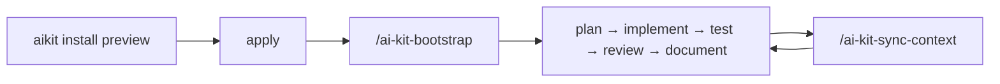

# AI-KIT

**Stop re-explaining your project to every new AI chat.**

AI-KIT gives your coding agents persistent project memory, expert stack rules, **Kubernetes-ready** container guidance, an **adaptive model routing** policy, and native entry files and configuration for **11 AI clients**. Add **Cloudflare security-audit** for structured security review and **Strix** for scoped pentesting workflows. One offline installer, zero installer dependencies, changes previewed before you apply them.

What changed in each release: [CHANGELOG](CHANGELOG.md).

**v1.6.0:** English chat defaults, Devin (Windsurf), JavaScript/Node.js, optional UUIDs and human Claude GitHub identity. [Release verification and publication status](docs/V1_6_0.md).

**Published and verified:** [PyPI `ai-kit-python 1.6.0`](https://pypi.org/project/ai-kit-python/1.6.0/) installs from the public index; [Docker Hub `tigusigalpa/ai-kit:1.6.0`](https://hub.docker.com/r/tigusigalpa/ai-kit) passed an immutable pull and offline checks. Both carry the same 319 packaged source files. [Checks, hashes and digest](docs/V1_6_0.md).

[Get AI-KIT](#get-ai-kit) · [Update AI-KIT](#update-ai-kit) · [Defaults](#defaults-you-should-know) · [Features](#features-at-a-glance) · [Honest boundaries](#honest-boundaries) · [Quick start](#install) · [Docs site](https://tigusigalpa.github.io/ai-kit-docs/) · [Guides](docs/guide/README.md) · [Install guide](docs/guide/INSTALL.md) · [CLI flags](docs/guide/INSTALLER_FLAGS.md) · [Windows](docs/guide/WINDOWS.md) · [Docker](docs/guide/DOCKER.md)

<table>
<tr>
<td align="center">

### 📘 Interactive documentation site

**Build your install command in the browser instead of reading flag tables.**

Pick your AI clients, preset, sharing mode, chat language and optional modules: the configurator writes the exact preview and apply commands for PowerShell or Bash and shows the resulting `settings.json` and file list. Every option is a real installer flag, and the commands are generated locally in your browser.

[⚙️ Command configurator](https://tigusigalpa.github.io/ai-kit-docs/#configure) · [💻 Install the CLI](https://tigusigalpa.github.io/ai-kit-docs/#install) · [🩺 After install](https://tigusigalpa.github.io/ai-kit-docs/#commands) · [📖 Flag reference](https://tigusigalpa.github.io/ai-kit-docs/#reference) · [❓ FAQ](https://tigusigalpa.github.io/ai-kit-docs/#faq)

English and Russian · light and dark themes · Windows PowerShell and Linux/macOS Bash

</td>
</tr>
</table>

## Get AI-KIT

**Python package (recommended).** Requires Python 3.10+; no mandatory third-party runtime dependencies.

~~~sh
pipx install ai-kit-python
aikit --version
~~~

The PyPI package is **`ai-kit-python`**; the command it installs is **`aikit`**. Never run `pip install aikit`: that is not this project's package name. Without pipx, run `python -m pip install ai-kit-python` inside a virtual environment. On Windows, the [Windows guide](docs/guide/WINDOWS.md) covers PATH and interpreter problems.

**Docker image.** [`tigusigalpa/ai-kit`](https://hub.docker.com/r/tigusigalpa/ai-kit) runs the same CLI without host Python (`linux/amd64`). Image tags follow the repository [VERSION](VERSION) of each release and there is no `latest` tag, so pick a version from the [tags page](https://hub.docker.com/r/tigusigalpa/ai-kit/tags), for example the verified `1.6.0`:

~~~sh
docker pull tigusigalpa/ai-kit:1.6.0
docker run --rm tigusigalpa/ai-kit:1.6.0 --version
~~~

Project mounts, preview/apply examples and the runtime contract are in [Run AI-KIT with Docker](docs/guide/DOCKER.md).

**Source checkout (alternative).**

~~~sh
git clone https://github.com/tigusigalpa/ai-kit.git
cd ai-kit
python scripts/install.py --help
~~~

From a checkout, run `python scripts/install.py` or `python aikit_cli.py COMMAND` directly, or run `python -m pip install .` there to get the `aikit` command. Details: [Get the CLI](docs/guide/INSTALL.md#get-the-cli).

## Update AI-KIT

**1. Update the Python package.** If you installed with pip, run this using the same Python environment as the existing installation (activate its virtual environment first if applicable):

~~~powershell
python -m pip install --upgrade ai-kit-python
python -m aikit.aikit_cli --version
~~~

The package name is **`ai-kit-python`**, not `aikit`. The module-based version check works even when `aikit.exe` is missing from PATH. If you installed with **pipx**, use this instead:

~~~powershell
pipx upgrade ai-kit-python
aikit --version
~~~

These commands install the newest version published on PyPI; unreleased source changes become available there only after a release. They update the CLI without rewriting the AI-KIT files already installed in your application projects.

**2. Update each application project separately.** Open a terminal in that project's root folder (`.` means the current directory), inspect the preview, then apply the update and run its health check:

~~~powershell
python -m aikit.aikit_cli install .
python -m aikit.aikit_cli install . --apply --check
~~~

For a pipx installation, use `aikit install .` and then `aikit install . --apply --check`. Omit `--agent`, `--mode` and module flags when you want to retain the project's saved choices. Existing project documents and local adaptations follow the preservation/conflict rules; review reported candidates before accepting a manual merge. Updating the CLI once does not automatically update every project.

For Docker, choose and pull an explicit new version tag and rerun the installer against the project mount; there is no `latest` image. [Full update and conflict guide](docs/guide/INSTALL.md#update-an-application-project) · [Windows troubleshooting](docs/guide/WINDOWS.md) · [Docker instructions](docs/guide/DOCKER.md).

## Defaults you should know

> [!IMPORTANT]
> **Chat replies and authored files default to English.** Conventions default to the owner's Laravel preferences: **no database foreign key constraints**, Policy/Factory/Seeder per model and one table per migration. **Public UUIDs are optional**, enabled by `--with-uuid` for any confirmed technology.
>
> For Russian replies and your project's own conventions, add both flags to the preview and the apply command:
>
> ~~~sh
> aikit install /path/to/my-app --chat-language Russian --conventions standard
> ~~~
>
> Other fresh defaults: private sharing mode, the `codex` client and maximum Docker cleanup. Existing projects retain their saved language and choices; update an existing language explicitly with `--chat-language English`. Claude installs suppress its added commit credit and preserve human authorship; `--with-claude-github` adds authenticated GitHub identity verification. [All defaults](docs/guide/INSTALL.md#choose-your-defaults) · [Owner profile](template/ai-kit/profiles/OWNER.md)

## Features at a glance

| | Feature | What it does for you |
| --- | --- | --- |
| 🧠 | **Project memory** | Verified facts, module map, commands, and decisions that every new chat reads first |
| 🧩 | **Stack profiles** | Expert rules for Go, PHP, Laravel, Filament 5, Moodle, Python, Rust, .NET, Java, Terraform/Helm, frontend, and libraries, auto-detected per module |
| 🐳 | **Kubernetes-ready container guidance** | The kit instructs agents to make new Dockerfiles and services Kubernetes-ready: probes, graceful shutdown, non-root execution and manifests |
| 🧭 | **Adaptive model routing** | A 0-6 capability ladder; the routing policy recommends a model role and reasoning effort per task. No savings are claimed |
| 🤖 | **11 AI clients** | Native entry files and configuration for Codex, Claude Code, Cursor, Copilot, Gemini CLI, Devin (Windsurf), Cline, Roo, Aider, Kimi and Manus. The legacy `windsurf` adapter remains compatible. Documentation for Kimi and Manus is unverified, and activation in actual clients is unverified |
| 🎯 | **Native client configuration** | Claude Code allow rules for the recorded test/lint/build commands (with `--with-native-settings`); module rules scoped to the paths where they apply (with `--with-scoped-rules`) |
| 🛡️ | **Guardrails that reduce risk** | No commits without your request, optional ask rules before destructive commands, deny rules and ignore files for secret files. Not a security boundary |
| 🔐 | **Optional security workflows** | Cloudflare's audit method and nine Strix skills, pinned and invoked explicitly in Codex or Claude Code |
| 🎨 | **Optional Web Design** | Annotated references and a brief become a coherent visual system, stack-aware implementation and recorded UI acceptance; includes a dedicated Blade route |
| 🔁 | **Engineering loop** | Plan → implement → test → review → document, with honest reporting of what was really checked |
| ⚡ | **One-command workflows** | `/ai-kit-bootstrap`, `/ai-kit-review`, `/ai-kit-sync-context` |
| 📦 | **Safe installer and upgrades** | Preview first, offline, backups, conflict candidates, explicit unchanged-adapter retirement, your local edits preserved |
| 🐋 | **Docker CLI image** | Run the bundled installer and helpers without host Python; mount your project, preview changes and apply explicitly |
| 🗂️ | **Shared dialogue context** | Import two conversations locally, review conflicting claims and export the same reference state for ChatGPT and OpenRouter |

## Why AI-KIT

AI-KIT preserves facts and decisions, points agents at real checks and records authorization boundaries:

- **Project knowledge:** manifests draft module facts and commands; bootstrap verifies them.
- **Stack depth:** relevant profiles cover framework authorization, transactions, cancellation, privacy and infrastructure review.
- **Your authority:** explicit commits/pushes, optional risky-command guards and secret exclusions.
- **Visible evidence:** unavailable checks remain unverified.

```mermaid
flowchart LR
    A[aikit install preview] --> B[apply]
    B --> C["/ai-kit-bootstrap"]
    C --> D[plan → implement → test → review → document]
    D --> E["/ai-kit-sync-context"]
    E --> D
```

## Feature tour

### Project memory that survives every chat

- **Verified context:** PROJECT_CONTEXT and project.json hold contracts, module facts, commands and unknowns.
- **Manifest drafts:** Go, Composer, Node, Python and Moodle evidence suggests versions and module commands until bootstrap confirms them.
- **Session start:** an optional Claude hook reads context and Git status.
- **Continuity:** decisions, ADRs and changelog preserve reasons; the continuity skill keeps context and pointers synchronized.

[What lands in your project](docs/guide/INSTALL.md#what-lands-in-your-project)

### Built for your stack

| Profile | What the agent gets right |
| --- | --- |
| [Go](template/ai-kit/stacks/GO.md) | Context propagation, timeouts, error wrapping, goroutine ownership, `-race`, govulncheck, deliberate vendoring |
| [PHP](template/ai-kit/stacks/PHP.md) | Composer and PSR boundaries, exact money, bounded HTTP, narrow exceptions, `composer audit` |
| [Laravel](template/ai-kit/stacks/LARAVEL.md) | Policies, bounded transactions, after-commit jobs, idempotent effects, N+1 checks, safe migrations |
| [Filament 5](template/ai-kit/stacks/FILAMENT.md) | Resources, schemas, tables, and actions with server-side authorization, tenant scope, and bounded queries |
| [Moodle](template/ai-kit/stacks/MOODLE.md) | Plugin APIs, capabilities and `sesskey`, upgrade savepoints, Privacy API, cache invalidation |
| [Python](template/ai-kit/stacks/PYTHON.md) | Safe CLIs, pathlib, subprocess without a shell, isolated environments, uv/ruff for new packages |
| [Frontend](template/ai-kit/stacks/FRONTEND.md) | Pinned package manager, type/lint/build checks, accessibility, public-config hygiene |
| [Library/SDK](template/ai-kit/stacks/LIBRARY.md) | Public API stability, semantic versioning, consumer examples, compatibility matrices |
| [Rust](template/ai-kit/stacks/RUST.md) | Ownership and borrowing, unsafe discipline, Result errors, cargo fmt/clippy/test, lockfile hygiene |
| [JavaScript / TypeScript / Node.js](template/ai-kit/stacks/JAVASCRIPT.md) | Node services, CLIs, workers and packages; ESM/CommonJS, async cancellation, input validation, actual package scripts |
| [.NET](template/ai-kit/stacks/DOTNET.md) | Nullable types, async with CancellationToken, deterministic disposal, dotnet build/test |
| [Java](template/ai-kit/stacks/JAVA.md) | Maven/Gradle wrappers, exception boundaries, try-with-resources, wrapper test/verify |
| [Terraform/Helm](template/ai-kit/stacks/INFRA.md) | Remote state, plan review, pinned providers and charts, fmt/validate and lint/template gates |

Profiles combine per module, so a monorepo with a Laravel app in `web/` and a Go service in `api/` gets the right rules in each place. Opinionated **owner conventions** for Laravel (no database foreign keys, Policy + Factory + Seeder per model, one table per migration, Filament 5+ for new panels) are the default; use `--conventions standard` to follow your project's own conventions instead. Public UUID guidance is an independent opt-in; see [optional UUIDs and Claude GitHub identity](#optional-uuids-and-claude-github-identity).

### Docker-aware, Kubernetes-ready guidance

The kit instructs agents to make new Dockerfiles and services Kubernetes-ready, following the [Kubernetes-ready contract](template/ai-kit/CONTAINERS.md), including local Docker Compose projects:

- **Images/runtime:** pinned multi-stage images, build secrets outside layers, non-root execution, read-only root, exec entrypoints; no privileged mode or Docker socket.
- **Lifecycle:** startup/readiness/liveness probes, SIGTERM drain, migrations in separate Jobs.
- **Deployment:** ConfigMap/Secret, stdout logs, stateless replicas, PVCs where needed, dropped capabilities, seccomp and resource requests.
- **Preflight/cleanup:** verify Docker client/daemon; after every Docker task remove eligible disposable containers, volumes, networks and superseded test images. The default `maximum` mode also removes the dedicated builder and its cache, without a size threshold, and reclaims host RAM/disk; `--docker-cleanup keep-cache` keeps the builder cache. [Cleanup modes and host reclamation](docs/guide/DOCKER.md#docker-cleanup-and-host-reclamation).

### Adaptive model routing

The [routing policy](template/ai-kit/router/POLICY.md) recommends a model role and reasoning effort for each task on a 0-6 capability ladder: the cheap role for classification and narrow mechanical edits, the work role for engineering and hard debugging, escalation after a diagnosed capability shortfall. Provider configurations map roles to OpenAI, Anthropic, Kimi, and Gemini models, or your own local/Ollama models. The offline helper understands English and Russian task descriptions and explains its choice:

~~~sh
aikit route "debug a race condition in the queue worker"
~~~

It is a recommendation, and no cost savings are claimed. The kit never fakes a model switch: when a client offers no switching control, you get a recommendation. [Levels, providers and configuration](docs/guide/MEASUREMENT.md#adaptive-model-routing).

### Works with your AI clients

| Client | What gets installed |
| --- | --- |
| Codex | `AGENTS.md` and `.agents/skills/` |
| Claude Code | `CLAUDE.md` importing AGENTS, skills, settings, path-scoped `.claude/rules/` |
| Cursor | `.cursor/rules/` with module globs, `.cursorignore` secrets |
| GitHub Copilot | `copilot-instructions.md` and per-module `.instructions.md` |
| Gemini CLI | `GEMINI.md` and `.geminiignore`; reads the shared skills |
| Devin (Windsurf) | `--agent devin`: `.devin/rules/ai-kit.md` and optional module rules; `--agent windsurf` retains the legacy `.windsurf/rules/` adapter |
| Cline, Roo | Native rule folders, with path-scoped module rules for Cline |
| Aider | `CONVENTIONS.md` and `.aiderignore`, plus model routing config |
| Kimi, Manus | Short entry files |

Scoped rules, ignore files, and settings come with the native-settings and scoped-rules extras. The preview spots the clients you already use from existing files and suggests the matching `--agent` list. Copying files does not prove that a client discovers or activates them, and documentation for Kimi and Manus is unverified; `aikit adapters report --project TARGET` lists each client's documentation status.

For a new **Codex + Claude + Devin (Windsurf)** setup, run this from the application directory:

~~~powershell
python -m aikit.aikit_cli install . --agent codex --agent claude --agent devin --mode private --preset strict --with-security-audit --with-strix --with-context7 --with-web-design --with-claude-github --apply --check
~~~

Add `--with-uuid` only if the project should adopt public UUID guidance. Explicit `--agent` flags describe the complete selection; include every client you want to keep. To move an existing installation from `windsurf` to `devin`, temporarily include **both** adapters in the full selection and preview/apply it. Then preview `aikit adapters retire . --agent windsurf` and repeat with `--apply` after review; the retirement removes only unchanged owned legacy rules and deselects `windsurf`. Edited legacy rules remain conflicts and are preserved. Devin loads both rule directories, so inspect overlapping rules before using it. The supported current paths and legacy imports are documented in [Devin Local customizations](https://docs.devin.ai/desktop/devin-local/customizations); `--agent devin` targets the local/desktop rule format.

### Optional UUIDs and Claude GitHub identity

| Option | Default | Effect |
| --- | --- | --- |
| `--with-uuid` | Off; independent of presets and `owner`/`standard` | Installs [public UUID guidance](template/ai-kit/UUID.md), saves `uuid=true`, and adds a short AGENTS entry for any confirmed language or technology. No code, columns, primary keys or routes are changed by installation. |
| `--with-claude-github` | Off; independent of presets | Installs [Claude GitHub identity guidance](template/ai-kit/CLAUDE-GITHUB.md), saves `claude_github=true`, and links it from the selected Claude entry. Before an authorized commit, Claude verifies the active account for the repository's GitHub host and matches human author/committer details. Missing or conflicting identity stops that commit for clarification. |

All Claude installations include the baseline human-authorship rule and request `attribution.commit` as an empty string in their managed local/team settings. This suppresses Claude's commit-credit trailer; it does not change Git's author fields. Existing custom attribution values produce a reviewable conflict instead of being overwritten. Existing human co-authors, signing and PR-attribution preferences are preserved. [Claude attribution reference](https://code.claude.com/docs/en/settings-reference#attributioncommit).

Example: add both policies to an existing project while preserving its saved client selection:

~~~powershell
python -m aikit.aikit_cli install . --with-uuid --with-claude-github
python -m aikit.aikit_cli install . --with-uuid --with-claude-github --apply --check
~~~

The GitHub policy needs Claude selected; add `--agent claude` alongside the full desired client list when necessary. Nothing logs in, queries GitHub, changes global Git settings, commits or pushes during installation. These flags persist across upgrades. Omitting them later does not disable them; review and set `uuid` or `claude_github` to `false` in `ai-kit/settings.json` to deselect. Existing files/data remain preserved. Changing a setting never authorizes destructive schema changes or a Git operation.

### Connect TypeUI to Codex and Claude

**TypeUI supplies design guidance; the coding client implements it in your project.** AI-KIT supplies the brief, project memory and acceptance workflow. Adding `--with-web-design` installs those local resources; registering and authenticating the TypeUI MCP server is a separate step. The commands below configure the clients you run them in, rather than the AI-KIT Docker container. The hosted service is not bundled or revision-pinned by AI-KIT.

#### 1. Prepare the application

Open a terminal in the application directory. Install/update AI-KIT, selecting the full client list you use; preview first by omitting `--apply --check`:

~~~powershell
python -m aikit.aikit_cli install . --agent codex --agent claude --with-web-design --apply --check
~~~

Keep an already-selected `--agent devin` or other client in that list if needed. Fill `docs/design/BRIEF.md` with the goal, audience, required pages/sections, content, reference URLs, assets, supported screen sizes and constraints. Put the approved visual direction in `docs/design/SYSTEM.md` and measurable checks in `docs/design/ACCEPTANCE.md`. Existing documents are preserved; review actual frameworks and versions before asking for implementation.

#### 2. Connect Codex

Check that the Codex CLI is available with `codex --version`, then register the official HTTP endpoint:

~~~powershell
codex mcp add typeui --url https://mcp.typeui.sh/mcp
codex mcp list
codex mcp login typeui
~~~

Complete the sign-in in the browser yourself. Start/reopen Codex and use `/mcp` in its terminal interface to inspect the active connection. In an IDE extension, inspect MCP servers and restart the extension after configuration changes. Listing a server proves registration; a successful authenticated tool call proves the current connection. [TypeUI's Codex guide](https://www.typeui.sh/docs/guides/codex) · [OpenAI MCP configuration and authentication](https://learn.chatgpt.com/docs/extend/mcp).

For project-scoped configuration, merge this table into the existing `.codex/config.toml` instead of replacing the file or creating a duplicate table:

~~~toml
[mcp_servers.typeui]
url = "https://mcp.typeui.sh/mcp"
~~~

Keep credentials out of that file and the repository; the client handles sign-in separately. Check which configuration is effective in the client you actually use. A remote/web session does not inherit a local process's configuration automatically.

#### 3. Connect Claude Code

From the same application directory, check `claude --version` and add the HTTP connection at the private, current-project scope:

~~~powershell
claude mcp add --transport http --scope local typeui https://mcp.typeui.sh/mcp
claude mcp list
claude
~~~

Inside Claude Code, enter `/mcp`, choose `typeui`, authenticate and finish the TypeUI sign-in. The local scope is stored under the project's entry in your personal `~/.claude.json`. For a team-shared endpoint use `--scope project` instead; Claude writes `.mcp.json`, and each teammate authenticates separately. Review an existing registration before adding another with the same name. [TypeUI's Claude guide](https://www.typeui.sh/docs/guides/claude) · [Claude MCP scopes](https://code.claude.com/docs/en/mcp#mcp-installation-scopes).

This example targets **Claude Code**. A Claude chat/desktop connector has its own setup; registering a CLI connection does not automatically configure every Claude application.

#### 4. Verify access and prepare the design context

Ask the client to inspect available TypeUI tools and check sign-in/access before generation. For the currently exposed tools, `typeui_check_access` and `typeui_get_usage` provide the access/usage checks. An account or plan requirement must be resolved in TypeUI; AI-KIT does not supply access or promise a free quota.

For a custom visual system, create or import a draft in TypeUI, review its Markdown, then publish it for MCP. Choose one visual system for the task. Keep AI-KIT's engineering/acceptance rules and reconcile conflicting visual instructions before generating. Follow [TypeUI's MCP workflow](https://www.typeui.sh/docs/overview/mcp-server) for the current account and publishing steps.

#### 5. Run a bounded design task

In Codex use `$web-design`; in Claude Code use `/web-design`. Supply a concrete request such as:

~~~text
Use the web-design workflow and the connected TypeUI tools.
Read docs/design/BRIEF.md, SYSTEM.md and ACCEPTANCE.md first.
Confirm the actual framework and package versions. Reuse the existing application.
Check TypeUI access, then prepare one approved visual direction.
Propose the page structure and implement the hero section first.
Review responsive behavior, keyboard access and real browser output.
Continue after that section meets the acceptance criteria.
Do not deploy or replace the project's tooling without an explicit request.
~~~

Treat generated prompts as design inputs under the project's instructions. Review any returned skill-install command before executing it; choose a project-local location and inspect existing files. For a multi-section TypeUI workflow, complete the requested cleanup/acceptance for the current section before asking for the next one. Record only reviewed decisions in the design documents. A generated layout still needs the project's actual build/tests and browser review.

#### Troubleshooting TypeUI

| Symptom | Check and resolution |
| --- | --- |
| `codex` or `claude` is not recognized | Install/repair that client's CLI and PATH using its own documentation. `python -m aikit.aikit_cli` starts AI-KIT, not either coding client. |
| Server is listed but no tools are available | Inspect `/mcp`, verify the configured endpoint, authenticate, then restart/reconnect the client. Check whether it is using user, project, or another environment's configuration. |
| Browser login fails or the server returns 401/403 | Reauthenticate through the client, verify the intended TypeUI account and current access, and inspect organization/network restrictions. Keep credentials out of chat and Git. |
| `aikit mcp report .` does not show a registered server | The report inventories project files only. Codex user configuration and Claude's local-scope registration are outside that report; use their native connection status. |
| TypeUI works in Codex but not Claude | Each client has a separate MCP registration and sign-in; complete both setup paths. |
| Output disagrees with the brief or changes framework | Reconcile the brief, the selected visual system and the actual stack; rerun one bounded section with explicit constraints. Review changes before continuing. |

These instructions are source-checked setup guidance. Live authentication and generated-site acceptance must be verified in the target clients.

### Native configuration from your project facts

- **Recorded checks:** Claude Code allow rules for the recorded test/lint/build commands (with `--with-native-settings`).
- **Secret exclusions:** shared lists cover env files, keys, Composer auth, Laravel/Moodle credentials and .pypirc through selected client deny/ignore controls.
- **Module scope:** native rules select relevant guidance by file path (with `--with-scoped-rules`).
- **Owned entries:** Claude settings merge by key, using local settings in private mode and moving only kit entries on mode switches.

### Guardrails that reduce risk

These guardrails reduce risk through instructions, client ask/deny rules and ignore files. They are not a security boundary or a sandbox.

- **No surprise commits.** Commits and pushes require your explicit request, and optional Claude Code ask rules back that up.
- **Confirmation before damage.** With data guards, Claude Code asks before `rm -rf`, `git reset --hard`, `git clean`, a Docker prune, or a Laravel/Moodle migration.
- **Secret files.** Deny rules and ignore files discourage reads of common secret files in clients that honor them; they do not encrypt or lock those files.
- **Security baseline:** input validation, server-side authorization, and no secrets in code, logs, or prompts. Dependency audits run per stack with `composer audit`, `govulncheck`, `pip-audit`, and your package manager's audit.
- **Honest verification:** unavailable tools, services, or CI are reported as unverified, never as passed.

### Engineering loop and one-command workflows

Every task follows **plan → implement → test → review → document**, with staged migrations and rollback plans, review by concrete scenario and severity, and a changelog entry for every change. Owner conventions add a Codecov gate of at least 90% of changed lines when Codecov is configured. Three user-invoked skills make the routine instant:

- `/ai-kit-bootstrap` confirms installer drafts and fills context from real evidence.
- `/ai-kit-review` reviews current changes against the engineering and security rules.
- `/ai-kit-sync-context` updates context, decisions, and the changelog after work.

In Codex, use `$ai-kit-bootstrap` and the other skills the same way.

### Security workflows

| Integration | What it adds | Install flag | Codex / Claude Code |
| --- | --- | --- | --- |
| **Cloudflare security-audit** | Security guidance and focused review; a full audit method with reconnaissance, hunting, evidence validation, coverage and reporting | `--with-security-audit` | `$security-audit` / `/security-audit` |
| **Strix** | Workflows for code, web application, API and OWASP testing, findings review and requested remediation; separate CI/cloud references | `--with-strix` | `$strix` / `/strix` |

Both are off by default, pinned to reviewed upstream revisions and invoked explicitly. Installation copies files only: it runs no audit or scan, and a Strix scan needs its own CLI, Docker, model access and authorized targets. [Security workflows guide](docs/guide/SECURITY_WORKFLOWS.md).

### Web Design

Give your agent the sites you like, a short brief and the target project. The optional module (`--with-web-design`) organizes that material into one visual direction, reusable components and a working interface with recorded checks, with a detailed Laravel/Blade route and conditional guidance for Tailwind, Bootstrap, Alpine, Livewire, daisyUI, Flowbite and Flux. It installs no external tools and generates or deploys nothing by itself. [Web Design guide](docs/guide/WEB_DESIGN.md): [implementation routes](docs/guide/WEB_DESIGN_STACKS.md) · [tools, review and troubleshooting](docs/guide/WEB_DESIGN_TOOLS.md).

### Library documentation with Context7

The optional `context7-docs` workflow (`--with-context7`) checks the dependency version, resolves the library, retrieves focused examples and records source/coverage gaps. MCP connection and authentication stay separate. [Context7 guide](docs/guide/CONTEXT7.md).

### Shared context from two dialogues

The offline `aikit memory` command imports two conversations, preserves their sources, shows contradictions for your review and exports the same reviewed reference state as ChatGPT Markdown and an OpenRouter request fragment. It uploads nothing and needs no API key. [Dialogue context guide](docs/guide/DIALOGUE_MEMORY.md).

### Optional orchestration

`--with-orchestration` adds scoped Codex helper agents and a disabled-by-default, bounded OpenRouter text executor with explicit apply, capped-key preflight, private accounting and review. Installation launches no agents and makes no paid calls. [Orchestration guide](docs/guide/ORCHESTRATION.md).

### Working with OpenRouter

AI-KIT rules, project facts and selected context can travel with your API requests; the guide covers request layout, prompt and response caching, and measuring actual usage. [OpenRouter guide](docs/guide/OPENROUTER.md).

### Run AI-KIT with Docker

The `tigusigalpa/ai-kit` image runs the installer and helpers with a read-only root, no network and an explicit project mount: preview with a read-only mount, then apply with a writable one. [Docker guide](docs/guide/DOCKER.md).

### Measure, recommend and select context

`aikit benchmark` runs isolated A/B/C trials through a reviewed worker, `aikit route --mode adaptive` recommends from comparable history, and `aikit context select` selects module rules within a byte budget. [Measurement guide](docs/guide/MEASUREMENT.md).

### More built in

- **Language/sharing:** English files and chat by default; saved project languages remain unchanged on upgrades. Private or team instructions. [Sharing](docs/guide/INSTALL.md#sharing).
- **Health:** `aikit doctor TARGET` reports managed-file, link, provider and context drift and names the upgrade commands when a newer AI-KIT is available; `--fix` previews a repair plan and `--fix --apply` writes it, preserving local edits. An older CLI refuses to downgrade a newer installation unless you pass `--allow-downgrade`.
- **MCP review:** `aikit mcp report TARGET` lists MCP servers from project client files with transports, commands and variable names, never secret values, and warns about literal credentials, plain remote HTTP and auto-approval. [Details](docs/guide/INSTALL.md#review-mcp-servers).
- **CI:** `--with-ci` adds a workflow that validates the committed AI-KIT files; it does not clone or install AI-KIT and is meaningful in team mode.
- **Measurements:** `aikit metrics` records supplied attempt/token/cost evidence and analyzes provider results. No automatic telemetry; evaluation checks opaque pair coverage.

## Honest boundaries

- **Installation copies files.** It runs no audit, scan, model call, cleanup or external tool setup; optional modules need their own tools, credentials and authorization.
- **Client activation is unverified.** AI-KIT writes native entry files and configuration; whether a client discovers and applies them must be checked in that client. Documentation for Kimi and Manus is unverified.
- **Routing recommends.** Confirm actual client controls; no cost savings are claimed.
- **Guardrails reduce risk.** Permission rules and ignores are not a security boundary.
- **Measurement needs evidence.** The benchmark requires its own reviewed protocol worker. Optional OpenRouter text execution is separately enabled and explicitly applied; native client activation and end-to-end savings require independent verification.
- **CI checks files, not behavior.** The `--with-ci` workflow validates committed AI-KIT files only; it does not run your application's tests.

## Install

Quick start in three steps.

Use an application folder outside any AI-KIT checkout.

**1. Preview.** Nothing is written:

~~~sh
aikit install /path/to/my-app --preset solo --agent codex --agent claude
~~~

On Windows use a path like `"C:\Projects\my-app"`. The preview lists writes, preserved files, conflicts, and detected stacks/clients. Add `--chat-language English --conventions standard` here and in step 2 to change the [defaults](#defaults-you-should-know).

**2. Apply** the same command with `--apply`; add `--check` to run the doctor right away:

~~~sh
aikit install /path/to/my-app --preset solo --agent codex --agent claude --apply --check
~~~

**3. Bootstrap.** Open your AI client in the project and run `/ai-kit-bootstrap` (Claude Code) or `$ai-kit-bootstrap` (Codex). For other clients, give it [BOOTSTRAP_PROMPT.md](BOOTSTRAP_PROMPT.md).

Existing project documents and context are never overwritten; customized instructions become reviewable conflicts. From a source checkout, `python scripts/install.py` takes the same arguments; in Docker, see [preview and apply](docs/guide/DOCKER.md).

## Documentation

- **[Documentation site](https://tigusigalpa.github.io/ai-kit-docs/)**: an interactive command configurator, CLI installation for Windows and Linux/macOS, post-install commands and a searchable flag reference, in English and Russian
- [All guides](docs/guide/README.md)
- [Install AI-KIT and set up a project](docs/guide/INSTALL.md): CLI, defaults, presets, what lands in your project, sharing, updates
- [Installer flags and options](docs/guide/INSTALLER_FLAGS.md), also as JSON via `aikit flags`
- [Windows: installation and troubleshooting](docs/guide/WINDOWS.md)
- [Run AI-KIT with Docker](docs/guide/DOCKER.md), including Docker cleanup and host reclamation
- [Security workflows](docs/guide/SECURITY_WORKFLOWS.md), [Web Design](docs/guide/WEB_DESIGN.md), [Context7](docs/guide/CONTEXT7.md), [shared dialogue context](docs/guide/DIALOGUE_MEMORY.md)
- [Optional orchestration](docs/guide/ORCHESTRATION.md), [working with OpenRouter](docs/guide/OPENROUTER.md), [measurement and context selection](docs/guide/MEASUREMENT.md)
- [CHANGELOG](CHANGELOG.md) · [SKILL.md](SKILL.md) · [CONTRIBUTING.md](CONTRIBUTING.md) · [SECURITY.md](SECURITY.md) · [License](LICENSE)

## Teach any AI about AI-KIT

The repository is a skill: [SKILL.md](SKILL.md) covers installation, configuration, upgrades and maintenance. For Claude Code, clone into your skills directory:

~~~sh
git clone https://github.com/tigusigalpa/ai-kit.git ~/.claude/skills/ai-kit
~~~

For other assistants, share the repository or SKILL.md.

## For maintainers

Applications install from `template/`; the root maintains AI-KIT itself. Before contributing, run:

~~~sh
python scripts/check_kit.py
python -m unittest discover -s tests -v
~~~

See [CONTRIBUTING.md](CONTRIBUTING.md) and the [maintainer guide](docs/guide/MAINTAINERS.md) for local maintainer files, publication copy and the PyPI release procedure.

## License

AI-KIT is released under [MIT](LICENSE); bundled Cloudflare references retain MIT and Strix references retain Apache-2.0. Choose and verify your application's license separately.
